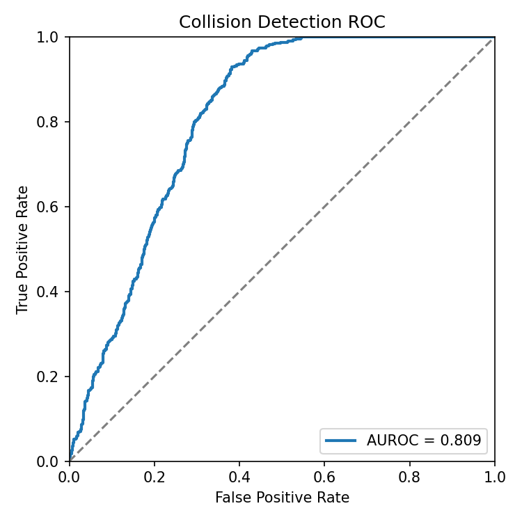
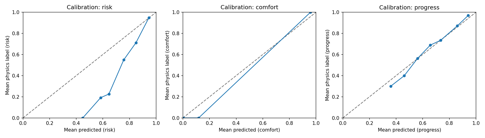

# PlanCritic

A learned trajectory critic for autonomous vehicles. Scores candidate trajectories on risk, comfort, and progress using a neural network trained on physics-based pseudo-labels.

## Why I built this

Motion planners produce candidate trajectories, but ranking them is hard. Hand-tuned cost functions break on edge cases, and human labels don't scale. PlanCritic learns to score trajectories using physics checks (collision, jerk, progress) as free supervision, so you get a differentiable evaluator without any annotation effort.

## Results

Trained on 1000 synthetic scenes, evaluated on a held-out 200-scene test split (seed 42).

| Metric | Value |
|---|---|
| Collision AUROC | 0.809 |
| Spearman (risk) | 0.720 |
| Spearman (comfort) | 0.749 |
| Spearman (progress) | 0.861 |
| MAE risk | 0.372 |
| MAE comfort | 0.031 |
| MAE progress | 0.059 |





<!-- screenshot: capture with instructions below -->


## Architecture

```
Ego State       Lane Graph       Candidate
Features        Encoder (GNN)    Trajectories
    |               |                |
    +---------------+----------------+
                    |
           TrajectoryCritic
           (multi-head MLP)
                    |
        +-----------+-----------+
        |           |           |
      Risk       Comfort     Progress
      Score       Score        Score
```

The critic takes encoded ego state, lane graph, and trajectory features, then outputs per-candidate scores for three heads plus a composite. Training uses physics-based pseudo-labels: time-to-collision, jerk penalties, and route progress. No human annotations required.

## Quickstart

```bash
git clone https://github.com/aayushimalhotra3/plancritic.git
cd plancritic
pip install -e .

# Train on synthetic data
python scripts/run_training.py

# Train on WOMD
python -m plancritic.cli.train \
  --data-path /path/to/womd \
  --dataset womd \
  --output-dir ./outputs \
  --num-epochs 50

# Score trajectories
python -m plancritic.cli.score ./outputs/critic_best.pth \
  --data-path /path/to/scenarios \
  --output scores.json

# Web viewer (static HTML, no build step)
open web/index.html
```

## Reproduce

To regenerate the results above from scratch:

```bash
pip install -e .

# Train with early stopping on 1000/200/200 split, seed 42
python scripts/run_training.py

# Outputs:
#   results/checkpoints/synthetic_v1/best_model.pt
#   results/checkpoints/synthetic_v1/final_model.pt
#   results/plots/{auroc,spearman,calibration,training_loss}.png
#   results/metrics.json
```

The script generates synthetic data, trains for up to 80 epochs with patience-10 early stopping on val loss, then evaluates on a 200-scene test split and writes all plots and metrics. Everything is seeded (seed=42) for reproducibility.

## Tech stack

- Python, PyTorch, PyTorch Geometric
- Vanilla JS + HTML for the web viewer

## Limitations

- Physics checks use simplified vehicle models (axis-aligned bounding boxes)
- Lane graph encoding does not use full HD map features
- Single-agent only; no multi-agent interaction modeling

## Citation

```bibtex
@software{plancritic2026,
  title={PlanCritic: Learned Trajectory Evaluation for Autonomous Vehicles},
  author={Aayushi Malhotra},
  year={2026},
  url={https://github.com/aayushimalhotra3/plancritic}
}
```

## License

MIT. See [LICENSE](LICENSE).
